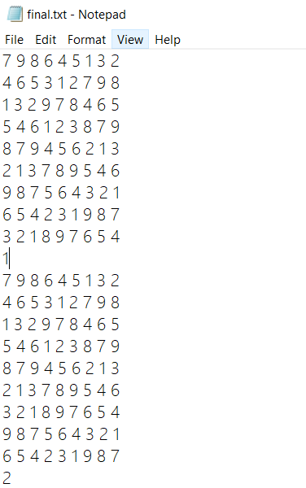

# 《数独生成与求解》用户手册

#### ---结对编程作业            [GitHub 链接](https://github.com/OAACKY/SE_pair_programing)

1811338 计卓 常珂源

1811365 计科 黄鑫鹏

## 软件使用说明：

软件为控制台程序，需要使用命令行给予不同的参数运行。

软件输入：

第一个参数默认为应用程序名，之后的参数用来选择功能，如下表所示：

|          |                      |               |                             |
| -------- | -------------------- | ------------- | --------------------------- |
| 参数名字 | 参数意义             | 范围限制      | 用法示例                    |
| -n       | 需要游戏数           | 1-10000       | ./sudoku.exe -n 66          |
| -m       | 生成游戏难度         | 1-3           | ./sudoku.exe -n 66 -m 1     |
| -r       | 游戏的挖空范围       | 20-55         | ./sudoku.exe -n 66 -r 27~37 |
| -u       | 游戏解是否唯一       |               | ./sudoku.exe -n 66 -u       |
| -s       | 需要解的数独文件路径 | 相对/绝对路径 | ./sudoku.exe -s game.txt    |
| -c       | 需要的终盘数         | 1-1000000     | ./sudoku.exe -c 100000      |

软件输出：

根据不同的功能进行所需的数独输入输出。

---

### 软件使用截图示例：

---

### 软件说明：

1. 对于数独终局生成算法，本软件算法为：先生成第5宫作为种子，然后交换行列生成4,6宫，同样的方法生成2,8宫，最后交换行列生成剩余的宫。之后对于123行及789行可以进行全排列，同时4,6宫可以整体交换，对于123列及789列和2,8宫也是如此，共有3!\*2*3!\*2\*9!(52254720)种排列组合，足够生成。
2. 对于数独游戏生成算法，本软件是根据终局生成算法挖空得到的，如果未声明挖洞的数目，那么就随机挖20-55之间的数目的空。对于不同的游戏难度，这里的判断比较简单，就是依照空的数目来判定的，简单难度空数目分布在20附近，中等难度在35附近，困难在55附近。
3. 对于有唯一解的数独，本软件是挖空，然后按照解数独的算法，每挖一个空，然后判定是否有多解，如果是的话就跳过这个位置继续挖，直到挖够20+10内的随机空为止。(这里考虑如果空过多的话搜寻多解复杂度过高)
4. 对于解数独算法，这里采用了高效的DLX舞蹈链算法，将求解数独的问题转化为精确覆盖问题进行求解。

---

### 代码质量分析：

采用Tscancode进行静态代码质量分析。

其中三个警告都是声明时有成员变量没有进行初始化。进行初始化后就警告消除。

---

### 单元测试结果：

单元测试一共十项，全部通过。

覆盖率根据输入的命令行不同而不同。由于多为文件写入操作和随机生成操作，单元测试很难针对一些函数进行编写测试样例。

1. -c命令和-s命令.覆盖率都为21%

2.  -n，-n-r,  -n-m 三个命令覆盖率为23%

3. -n-u命令，覆盖率为29%

